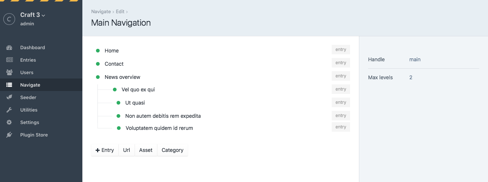

# Navigate for Craft CMS 3.x


## Requirements

This plugin requires Craft CMS 3.0.0 or later.

## Installation

To install the plugin, follow these instructions.

1. Open your terminal and go to your Craft project:

        cd /path/to/project

2. Then tell Composer to load the plugin:

        composer require studioespresso/craft-navigate

3. In the Control Panel, go to Settings → Plugins and click the “Install” button for Navigate.

## Navigate Overview



## Templating

### craft.navigate.raw

`craft.navigate.raw` will give you an array of the items you added to the navigation, with children for each if you have those. 
For each node you will have access to:

```twig


	{{ node.name }}
	{{ node.url }}
	{{ node.classes }}
	{{ node.target }}
	{{ node.children }}
 
```

This gives you complete control over the HTML & CSS used to display your navigation.

Here's an example of how to show a navigation and it's possible children using a twig macro:

```twig


    
    <li class="{{ node.classes }}">
        <a  href="{{ node.url }}" class="active" 
        target="_blank" rel="noopener">{{ node.name }}
        </a>
        
            <ul>
            
                {{ macros.renderNode(child) }}
            
            </ul>
        
    </li>


<div>
    <ul>
    
        {{ macros.renderNode(node) }}
    
    </ul>
</div>
```

### craft.navigate.render

The `render` function gives you the option to let the plugin build the HTML for you. You can add the following options:

```twig
{{ craft.navigate.render('navHandle', {
    wrapperClass : 'navbar',
    ulClass: 'navbar-nav',
    listClass: 'nav-item',
    linkClass: 'nav-link'
}) }}
```

This will return HTML, with the classes you specified, based on how [Bootstrap](http://getbootstrap.com/docs/4.1/components/navbar/) does navigations


Brought to you by [Studio Espresso](https://studioespresso.co)
